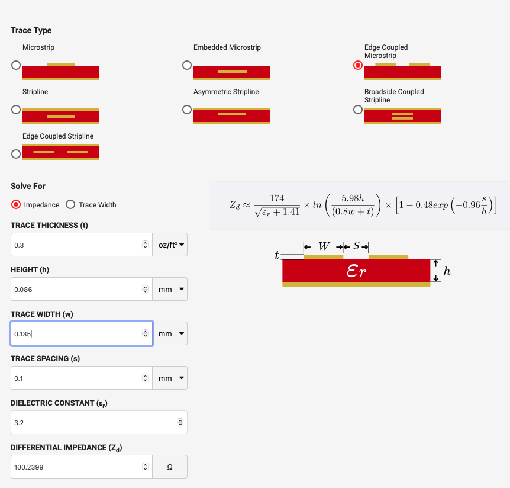

# teaMachineFCBMicroUSBAdapter

## Requirements
teaMachine used to use a COTS (Commercial Off-The-Shelf) micro USB cable. However, the connector is too large and does not fit when the device is fully assembled. Goal of the project was to design FPCB (flexible printed circuit board) which will connect touch panel to the raspberry pi zero (USB hub is only for debug pruposes)

## Solution
To resolve this issue, a custom flexible printed circuit board (FPCB) was designed:
- Designed in **EasyEDA** (quick and COTS components to buy from LCSC).
- Utilized a micro USB plug from **LCSC**.
- Manufactured by **JLCPCB**.
- optimized the size to be smaller than 10x10cm (below those dimensions FPCB are for 2$, exceeding those dimensions can increase the prise easily even 10 times)

## Project Overview

### Prototyping

First prototypes has been made with 'PaperCAD' to test fit dimensions.

### Stackup

### 3D Views
**Top View**  

**Bottom View**  

### Trace Design
**100 Ohm Differential Pair Routing**  

### Flex Preview

## Assembled flat cable

Assembled cable is working, dimensions are correct, only micro USB footprint is horrible to solder, so this should be corrected.

